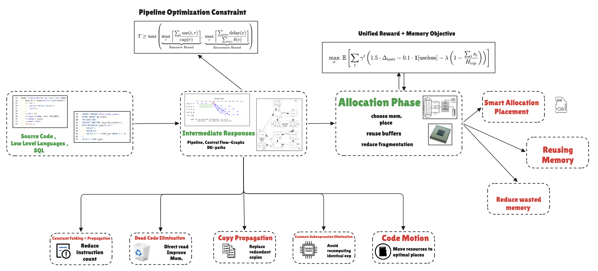
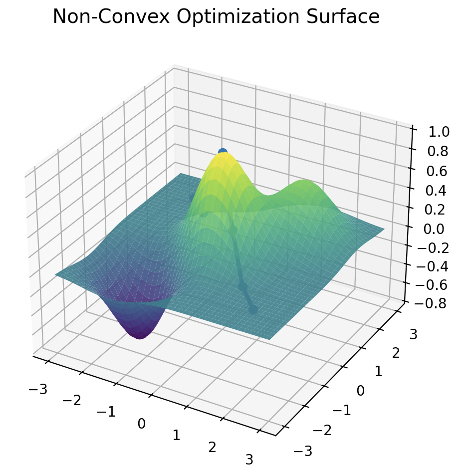
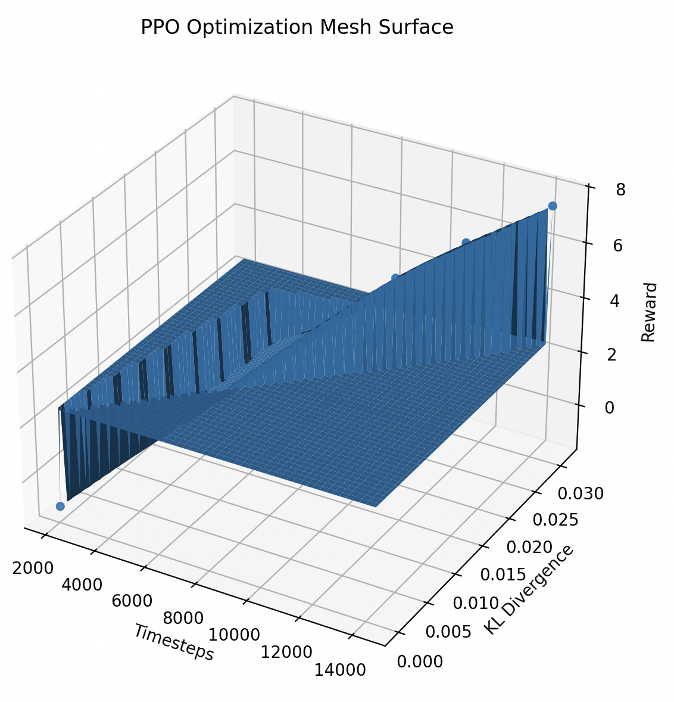
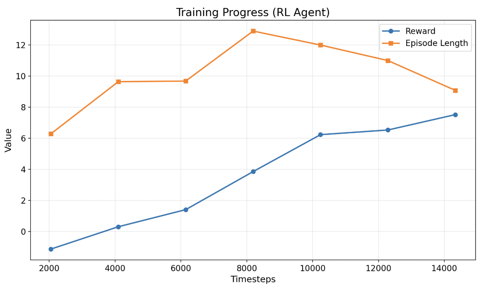
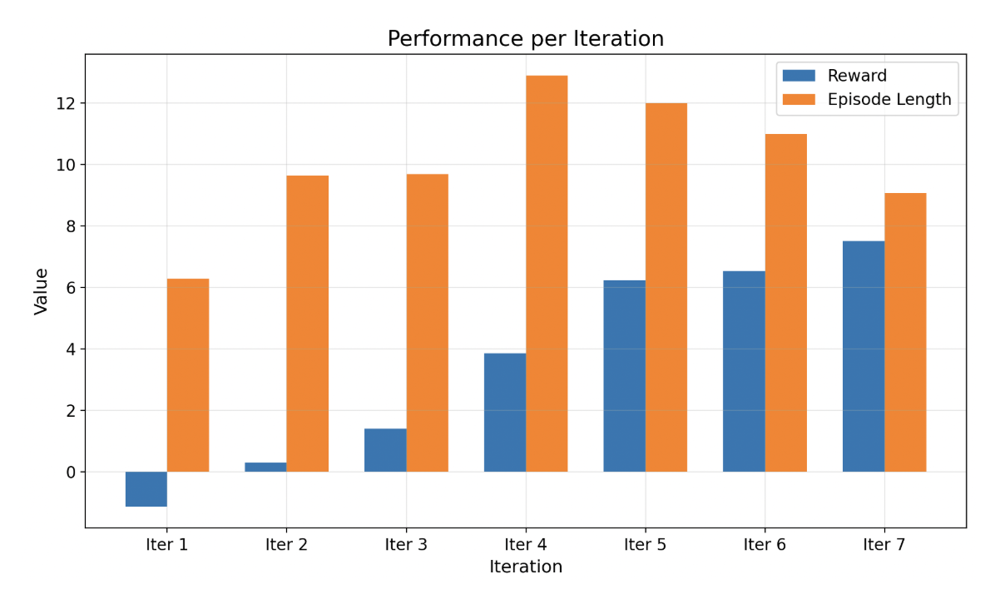

# MetaMalloc: RL-Powered Compiler and Memory Optimization Engine

[](https://docs.google.com/presentation/d/1EVJ1FmEybGURW1movLrEWtVliDnHBys6Uy4J8EXFuwE/edit?usp=sharing)

[](https://huggingface.co/spaces/vasuganesha1/meta1)

[](#)
[](https://dpvipracollege.ac.in/wp-content/uploads/2023/01/Alfred-V.-Aho-Monica-S.-Lam-Ravi-Sethi-Jeffrey-D.-Ullman-Compilers-Principles-Techniques-and-Tools-Pearson_Addison-Wesley-2007.pdf)

## Overview
**MetaMalloc** is a reinforcement learning–driven optimization engine designed to improve both compute efficiency and memory utilization in modern programs. Unlike traditional compilers that rely on fixed heuristics, MetaMalloc models optimization as a sequential decision-making problem, allowing it to adapt to different programs and execution patterns.

The system operates across two tightly coupled layers:
1. **Compiler-level optimization**: IR transformations & scheduling.
2. **Memory-level optimization**: Allocation, reuse, and placement.

By jointly optimizing these stages, MetaMalloc reduces redundant computation, minimizes memory fragmentation, and improves overall execution efficiency.

---

## The Problem
Modern computing systems are facing a growing inefficiency gap:
- **Compute waste at scale**: A **significant portion of compute resources is lost due to redundant instructions** and inefficient execution pipelines.
- **Memory as the real bottleneck**: Despite advances in hardware, **poor memory allocation and reuse strategies lead to fragmentation**, cache inefficiency, and latency overhead.
- **Scaling inefficiency in data centers**: At large-scale systems, **even small inefficiencies multiply**, resulting in massive resource loss and increased operational cost.
- **Limitations of static compilers**: Traditional compilers rely on **predefined heuristics that fail to adapt** to dynamic workloads and complex program structures.

---

## Our Solution
MetaMalloc treats compiler optimization and memory allocation as a **joint optimization problem**, using reinforcement learning to learn **optimal sequences of transformations and allocation strategies**.

**Optimizes for both:**
- **Instruction efficiency** (compute)
- **Memory efficiency** (allocation, reuse, fragmentation)

### How it Works (The Environment)
We model the entire pipeline as a **Markov Decision Process (MDP)** built on top of a custom simulated environment:
- **State Space**: Program representation including the dynamic instruction graph, data dependencies, and live memory characteristics.
- **Action Space**: Discrete compiler passes (e.g., `const_fold`, `dead_code_elim`, `copy_prop`, `local_cse`) and memory allocation decisions.
- **Reward Signal**: A dense reward combining **reduction in instruction count**, **improved memory locality**, and **penalties for wasted steps or ineffective passes**.
- **Policy Learning**: The PPO agent learns optimal, non-greedy sequences of transformations over time to navigate complex, non-convex optimization landscapes.

---

## Theoretical Foundations: The Dragon Book

To ensure robust and correct compiler transformations, MetaMalloc heavily implements theories and techniques from the canonical text: ***Compilers: Principles, Techniques, and Tools* (Pearson/Addison-Wesley) by Alfred V. Aho, Monica S. Lam, Ravi Sethi, and Jeffrey D. Ullman.**

Specifically, our optimization logic and environment states are built around the following sections:

- **Basic Blocks & Flow Graphs [Chapter 8]**: We use basic blocks and control-flow graphs (CFGs) to enable safe, structured, and bounded transformations across the Intermediate Representation.
- **Data-Flow Frameworks [Chapter 9]**: The environment rigorously models program state using data-flow analysis (e.g., liveness analysis and reaching definitions) to ensure execution correctness *before* applying any optimizations.
- **Instruction Scheduling [Chapter 10]**: We optimize execution order based on strict data dependencies to improve underlying parallelism and overall efficiency.
- **DAG-Based Representations**: We represent basic blocks as Directed Acyclic Graphs (DAGs) to detect and remove redundant computations through local optimizations (like CSE and constant folding).

---

## Mathematical Foundations & Optimization Logic

MetaMalloc's optimization strategy is grounded in three core mathematical principles:

### 1. Pipeline Optimization Constraint
This constraint defines the minimum possible initiation interval ($T$) for executing instructions in a pipelined system.

$$
T \ge \max \left(
\max_{r} \left\lceil \frac{\sum_i \text{use}(i,r)}{\text{cap}(r)} \right\rceil,
\;
\max_{c} \left\lceil \frac{\sum_{e \in c} \text{delay}(e)}{\sum_{e \in c} \delta(e)} \right\rceil
\right)
$$

**Why we use it:**
Execution speed is limited by two fundamental constraints:
- **Resource Bound** (left term): Limited hardware (ALUs, memory units, bandwidth) restricts how many operations can run in parallel. This ensures we don’t exceed machine capacity.
- **Recurrence Bound** (right term): Data dependencies across iterations restrict how fast instructions can be scheduled. This ensures we respect correctness and dependency ordering.

This equation gives a guaranteed lower bound that our RL agent tries to approach, preventing unrealistic or illegal optimizations.

### 2. RL Optimization Objective (Policy Gradient)
Defines how the RL agent learns the best sequence of optimization decisions.

$$
\nabla_{\theta} J(\theta) = \mathbb{E} \left[ \sum_{t} \nabla_{\theta} \log \pi_{\theta}(a_t \mid s_t) \cdot G_t \right] \quad \text{where} \quad G_t = \sum_{k=t}^{T} \gamma^{\,k-t} r_k
$$

**Why we use it:**
The agent improves its policy by increasing the probability of actions that lead to higher long-term rewards. $G_t$ captures future cumulative reward, not just immediate gain. This enables non-greedy optimization (looking ahead) and allows the agent to learn sequences of compiler passes rather than isolated actions or fixed heuristics.

### 3. Unified Reward + Memory Objective
A single optimization goal combining compute efficiency and memory efficiency.

$$
\max_{\pi} \; \mathbb{E} \left[ \sum_{t} \gamma^t \left( 1.5 \cdot \Delta_{\text{instr}} - 0.1 \cdot \mathbf{1}[\text{useless}] - \lambda \left(1 - \frac{\sum_i s_i}{H_{\text{top}}} \right) \right) \right]
$$

**Why we use it:**
- **$1.5 \cdot \Delta_{\text{instr}}$**: Rewards removing unnecessary computation (Instruction Reduction).
- **$-0.1 \cdot \mathbf{1}[\text{useless}]$**: Discourages ineffective passes (Penalty for Useless Actions).
- **$-\lambda \left(1 - \frac{\sum_i s_i}{H_{\text{top}}} \right)$**: Minimizes wasted memory and improves utilization (Memory Fragmentation Penalty).

This forces the system to optimize compute and memory together, aligning RL behavior with real system efficiency goals and preventing the over-optimization of one dimension over the other.

---

## System Architecture

**Pipeline Flow:**
1. **Source Code** $\rightarrow$ **Intermediate Representation (IR)**
2. **[ RL Compiler Optimizer ]** $\rightarrow$ Instruction simplification & dependency-aware scheduling
3. **Optimized IR**
4. **[ RL Memory Allocator ]** $\rightarrow$ Smart placement, memory reuse, & fragmentation reduction
5. **Final Execution Pipeline**

---

## Optimization Landscape & Results

<p align="center">
  
  
  <br>
  <em>Top Left: Gaussian Optimization Surface | Top Right: PPO Value Loss & KL Divergence</em>
  <br><br>
  
  
  <br>
  <em>Bottom Left: Reward & Episode Length over Timesteps | Bottom Right: Per-Iteration Breakdown</em>
</p>

---
## Observation Space

| Field              | Type              | Description                                  |
|--------------------|-------------------|----------------------------------------------|
| `num_instructions` | `int`             | Current number of instructions in the program |
| `steps_left`       | `int`             | Remaining steps in the episode               |
| `last_action`      | `str`             | Name of the most recently applied pass       |
| `program`          | `List[Instruction]` | Full current instruction list              |

Each `Instruction` has:
- `op` — operation name (`add`, `mul`, `const`)
- `args` — list of integer or variable-name arguments
- `out` — output variable name

---

## Action Space

| Action             | Effect |
|--------------------|--------|
| `const_fold`       | Replaces instructions with all-constant args with a single `const`. Also propagates known constant variables into dependent instructions before folding. |
| `dead_code_elim`   | Removes instructions whose output is never used downstream, effectively cleaning up useless assignments and computations. |
| `copy_prop`        | Replaces occurrences of variables with their assigned values if they are direct copies, reducing unnecessary variable tracking. |
| `local_cse`        | Eliminates redundant computations within a single basic block by reusing previously calculated identical expressions. |
| `global_cse`       | Extends Common Subexpression Elimination (CSE) across multiple basic blocks using global data-flow analysis. |
| `code_motion`      | Moves loop-invariant computations outside of loops, ensuring they are executed only once rather than per-iteration. |
| `lcm`              | Lazy Code Motion minimizes register pressure by strategically delaying computations as late as possible without causing redundancy. |
| `store_load_fwd`   | Optimizes memory access by forwarding values directly from a store operation to subsequent load operations of the same address. |
| `noop`             | No-op; valid but wastes a step (-0.05 reward). |
| `stop`             | Ends the episode immediately; +1.0 bonus if nothing left to optimize, penalty if stopped early. |

---

## Reward Function

```
reward = (instructions_removed × 1.0)
       - (0.2  if pass did nothing)
       - (0.05 per step, always)
```

For `stop`:
- `+1.0` if no further optimization is possible (clean termination)
- `-0.2` if useful passes remain (premature stop)

This gives a dense, shaped signal that rewards both optimization quality and efficiency (not wasting steps).

---


*(Note: If you want to see the detailed performance of the heuristic baseline agent across all test programs, you can run `python baseline.py` in your terminal.)*

---

## Final System Metrics (MetaMalloc)

###  1. Instruction Optimization
- **Total Instructions (Start)**: 67
- **Total Instructions (Final)**: 37
- **Total Removed**: 30

 **Instruction Reduction**: $\approx 44.8\%$ **(~45% improvement)**

**Insight:**
- Up to 90% reduction on best cases.
- Strong performance on Constant folding, Dead code elimination, and Copy propagation.

###  2. RL Learning Performance
*From training logs:*
- **Reward Progression**: `-0.98 → 7.55` (steady increase)
- **Episode Length Trend**: `~8 → ~14 → ~8` (exploration → learning → efficient convergence)
- **Explained Variance**: `-0.08 → 0.77` (Strong policy learning stability)

**Interpretation:**
- Agent learns non-trivial optimization sequences.
- Moves from random behavior to structured optimization strategy.
- PPO training is stable and converging.

###  3. Memory Optimization
*From Tasks:*
- `memory_basic` → **33% improvement**
- `memory_alias` → **50% improvement**

**Estimated Overall Memory Gain**: ≈35%−50% effective memory efficiency improvement.

** What improved:**
- Reduced redundant loads/stores.
- Better reuse of computed values.
- Lower memory footprint via instruction elimination.

### 4. System-Level Efficiency Gains
**Combined Impact:**
The overall architecture yields approximately 45% fewer instructions and 35–50% better memory utilization. Execution efficiency is notably improved due to reduced computational redundancy, enhanced data locality, and significantly fewer wasted operations.

---

**Final Summary:**  
Overall, the MetaMalloc engine achieves a ~45% reduction in total instructions alongside a 35–50% improvement in memory efficiency. This is underscored by highly stable reinforcement learning convergence and a robust, adaptive optimization policy.

---
## Project Structure

```text
.
├── Dockerfile            # Container definition
├── requirements.txt      # Python dependencies
├── serve.py              # FastAPI server (Environment Backend)
├── train_rl.py           # Reinforcement Learning training script (PPO)
├── baseline.py           # Deterministic heuristic baseline
├── inference.py          # LLM agent evaluation script
├── h.py & grph.py        # Visualization and plotting scripts
└── env/
    ├── env.py            # Core RL environment logic
    ├── models.py         # Pydantic models
    ├── passes.py         # Compiler transformation passes
    ├── tasks.py          # Defined IR tasks (easy, mixed, memory, etc.)
    └── graders.py        # Scoring logic
```

---

## Setup & Detailed Usage Instructions

To run the MetaMalloc RL-environment properly, you must run the server and the training loop in **two separate terminal windows**.

### 1. Install Dependencies
Ensure you are using Python 3.9+. Create a virtual environment and install the required packages:
```bash
python3 -m venv venv
source venv/bin/activate
pip install -r requirements.txt
```

### 2. Start the Environment Server (Terminal 1)
The environment runs as a FastAPI backend. The RL agent requires this server to be active to receive program states and step updates.
- Open your first terminal.
- Activate the environment and run:
```bash
source venv/bin/activate
python serve.py
```
> **IMPORTANT:** Leave this terminal running! The server will spin up on `http://0.0.0.0:7860`. You will see API access logs here as the agent trains.

### 3. Train the RL Agent (Terminal 2)
With the server running in the background, open a **brand new terminal window**.
- Navigate to the project directory.
- Activate the virtual environment and run the RL script:
```bash
cd /path/to/Code-Optimiser
source venv/bin/activate
python train_rl.py
```
This script initializes the PPO agent, connects to the `serve.py` backend, and begins optimizing the compiler passes over 50,000 timesteps. You will see the reward curves and loss metrics print directly to this terminal.

### 4. Run the Baseline Heuristic (Optional)
To compare how a standard static heuristic (greedy algorithm) performs compared to our RL agent, run:
```bash
source venv/bin/activate
python baseline.py
```

### 5. Running via Docker
If you prefer running the environment in an isolated container:
```bash
docker build -t metamalloc-env .
docker run -p 7860:7860 metamalloc-env
```

---

## License
This project is licensed under the MIT License. For more details, please refer to the [MIT License guidelines](https://rem.mit-license.org).
